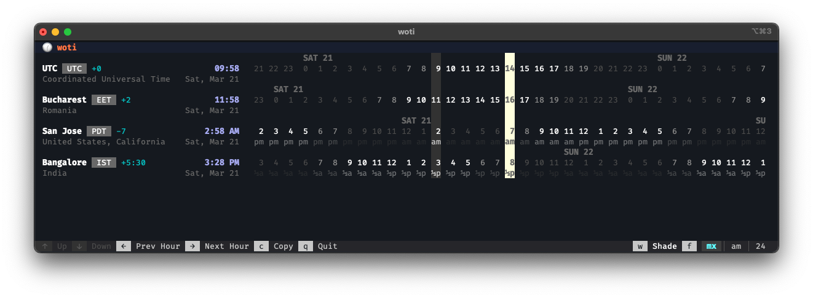

# 🕜 woti

World time in your terminal - see current times across time zones at a glance.



## Install

```
curl -fsSL https://raw.githubusercontent.com/aleris/woti/main/scripts/install.sh | sh
```

To install a specific version:

```
curl -fsSL https://raw.githubusercontent.com/aleris/woti/main/scripts/install.sh | sh -s -- --version v0.3.0
```

Supported platforms: macOS (Apple Silicon, Intel) and Linux (x86_64, aarch64).

The binary is installed to `~/.local/bin` (or `/usr/local/bin` when run as root).

## Usage

```
woti                        Launch the TUI
woti add PST                Add by timezone abbreviation
woti add Bucharest          Add by city name
woti add America/New_York   Add by IANA identifier
woti remove PST             Remove a timezone
woti --help                 Show help
```

Local and UTC are preconfigured by default. Configuration is stored in `~/.config/woti/config.toml`.

### TUI controls

- `←` / `→`: scroll the timeline by hour
- `↑` / `↓`: scroll timezone list
- `c`: copy the current selected hours column to clipboard
- `w`: turn workday hours shading on/off
- `f`: cycle time format (mixed -> am/pm -> 24h → …)
- `q` / `x` / `Esc`, `ctrl+c`: exit

### Configuration

The configuration is stored in a config file. 
On macOS/Linux the configuration file is located at `~/.config/woti/config.toml`.
The file is updated when changed from the cli. 
You can also update it directly (for example to reorder timezones).

## Development

Requires Rust 2024 edition (1.85+).

Before committing, run dev setup to install the git hook to increment version. 
```sh
make setup-dev
```

Build, test, run:
```sh
cargo build
cargo test
cargo run
cargo run -- --version
```

Release, pushes current version tag which triggers workflow on GitHub:
```sh
make release
```
